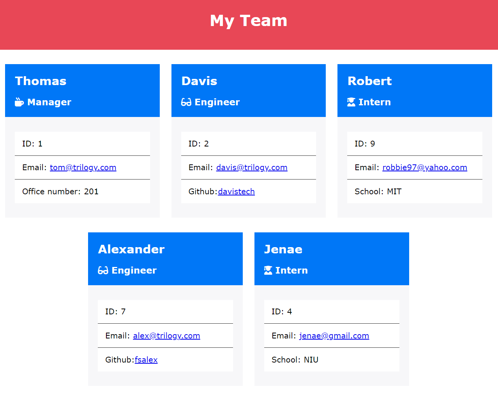
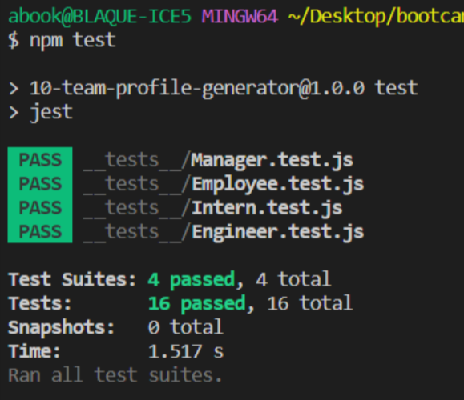
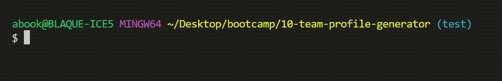
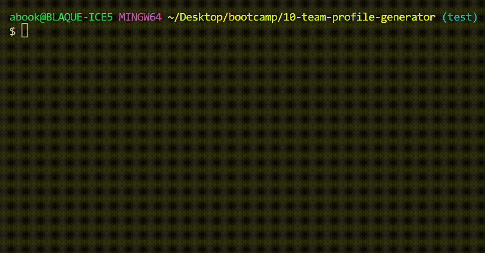

# 10 Team Profile Generator

## Table of Contents
1. [Description](#desc)
2. [Installation](#install)
3. [Usage](#usage)
4. [Demo](#demo)
6. [Tests](#tests)
7. [License](#license)

## Description 
Build a Node.js command-line application that takes in information about employees on a software engineering team and generates an HTML file that displays summaries for each person.

 
## Installation

1. Be sure to download NodeJS on your system before running this app.
2. In order to install the Inquirer package, please use `npm i inquirer@8.2.4`.

 
## Usage

1. After installation, initiate app by entering `node index.js` or `node .` from root directory.
2. Proceed to answer prompts as directed.
3. Upon completion of inquiry, you can find your `index.html` file in the /dist directory.

Here is a screenshot of the generated HTML file.

Here is a green light on all the test passing.

 
## Demo
View generated HTML file [here](https://ebonygrrl.github.io/10-team-profile-generator/dist/).

Here's an example of how to invoke this application.

Full video of demo

## Testing

To test this app, use `npm test` in your command line.

 
## License
All code is released under the [GNU General Public License](https://www.gnu.org/licenses/gpl-3.0.en.html).
